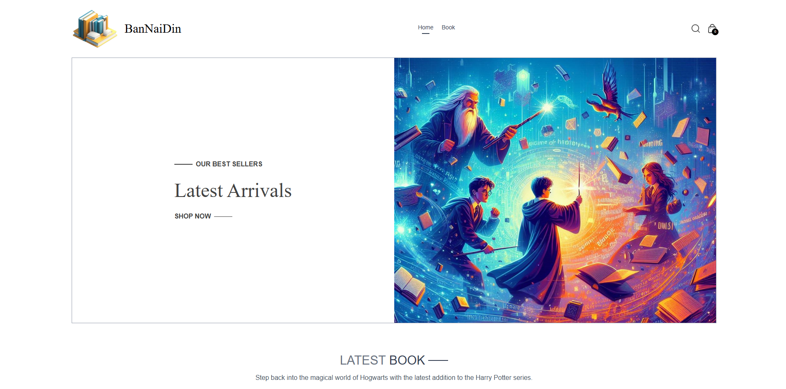

# BanNaiDin E-commerce Web App  
A modern and user-friendly web application designed to provide an intuitive and seamless experience. Built with responsive design principles, the platform ensures smooth navigation across all devices, including desktops, tablets, and mobile phones.


## Live Website 
[Live Demo 🚀](https://jumpadimit-bannaidin-web-app.netlify.app/)

## Features Skills
- React: Utilized for building the frontend interface, providing dynamic and interactive components.
- Vite: Employed as the build tool to optimize and bundle the project for production.
- Tailwind CSS: Integrated for responsive and customizable styling, enhancing the visual aesthetics of the website.
- Cart Management: Developed functionalities to add, remove, and update items in cart.
- Search Functionality: Implemented a search feature to enable users to find products efficiently based on their preferences.

## Technologies Used  
- React: JavaScript library for building user interfaces.
- Vite: Fast, modern build tooling for frontend development.
- Tailwind CSS: Utility-first CSS framework for rapid UI development.
- Custom Hooks: Utilized custom React hooks for managing state and logic efficiently.
- Git (for version control)
- Responsive For Mobile

## Installation & Setup  
If you want to run this project locally:  
1. Clone the repository to your local machine:

   ```bash
   git clone https://github.com/JumpAdimit/Softnova-Frontend-Quiz
   ```

2. Navigate to the project directory:

   ```bash
   cd Softnova-Frontend-Quiz
   ```

3. Install the project dependencies:

   ```bash
   npm install
   ```

4. Start the development server:
   ```bash
   npm run dev
   ```
